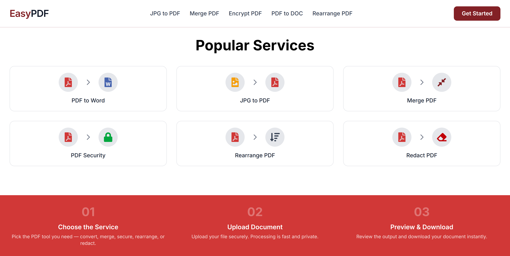

# 📄 EasyPDF

A simple and fast web application for handling common PDF tasks in one place. EasyPDF lets users convert, organize, secure, and edit PDF files without the complexity of traditional desktop software.

> **Live Demo:** *(Add your website link here)*

---

##  Preview

<!-- Add your homepage screenshot below -->

<p align="center">
  
</p>

---

##  Features

### 📄 PDF to Word

Convert PDF documents into editable Word files while preserving the document structure as much as possible.

### 🖼️ JPG to PDF

Combine one or multiple JPG images into a single PDF document.

### 🔀 Merge PDF

Merge multiple PDF files into one organized document.

### 🔒 Secure PDF

Protect PDF files with password encryption for improved security.

### 🗂️ Rearrange PDF

Reorder PDF pages by dragging and arranging them into the desired sequence.

### 🟥 Redact PDF

Permanently hide sensitive information from PDF documents before sharing them.

---

##  Tech Stack

* **Frontend:** React.js
* **Backend:** Node.js
* **Styling:** CSS / Tailwind CSS *(Update if different)*
* **PDF Processing:** PDF libraries and custom utilities

---

## 📂 Project Structure

##  Getting Started

### Clone the repository

```bash
git clone https://github.com/your-username/easypdf.git
cd easypdf
```

### Install dependencies

```bash
npm install
```

### Start the development server

```bash
npm run dev
```

---

## 📌 Available Tools

| Tool          | Description                               |
| ------------- | ----------------------------------------- |
| PDF to Word   | Convert PDFs into editable Word documents |
| JPG to PDF    | Convert images into PDF files             |
| Merge PDF     | Combine multiple PDFs into one            |
| Secure PDF    | Password-protect PDF documents            |
| Rearrange PDF | Reorder PDF pages                         |
| Redact PDF    | Remove sensitive information permanently  |

---

## ⭐ Support

If you found this project useful, consider giving it a ⭐ on GitHub. It helps others discover the project and motivates further development.
